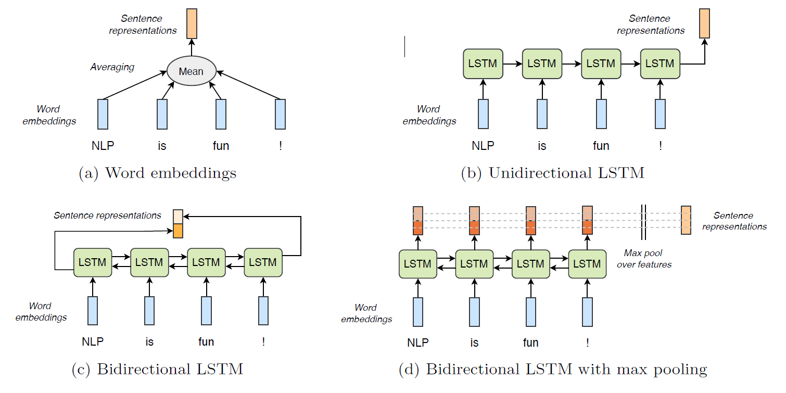
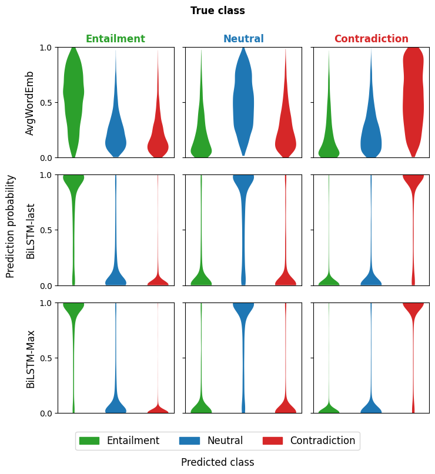
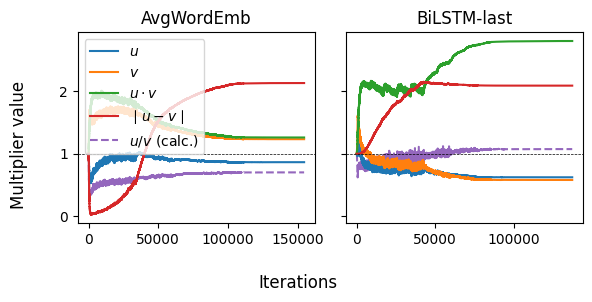

# Analysis of NLI model confidence & sentence embedding enhancements

This is a reprodicibilty report of [_Supervised Learning of Universal Sentence Representations from Natural Language Inference Data_ by Conneau _et al._ (2017)](https://arxiv.org/abs/1705.02364), where we reproduce and analyze the main findings. Various models are trained on a Natural Language Inference (NLI) task. These trained models function as encoders for sentence embeddings for [_SentEval_ by Conneau and Kiela (2018)](https://arxiv.org/abs/1803.05449), a benchmark transfer task suite. Furthermore, we analyze why certain models perform better than others by looking at the distribution and confidence of the predictions. Finally, we explore how sentence embeddings can be enhanced by multiplying them with trainable parameter.

<p float="left" align="middle">
   
   
  <br>
  
</p>

**Top left**. The four models that are implemented for the NLI task. **Top right.** Example of plots that are used to analyze the confidence and why certain models fail. **Bottom.** Each sentence embedding is enhanced by multiplying it with a trainable parameters. The multiplier behavior during training is shown.

## Installation instructions
Install and activate the conda environment.
```
conda env create -f env_nli.yml
conda activate nli2
```

Install SentEval inside the NLI repository
```
# Clone repo from FAIR GitHub
git clone https://github.com/facebookresearch/SentEval.git
cd SentEval/
cp ../nli/senteval_utils.py senteval/utils.py # see comment below

# Install sentevall and download transfer datasets
python setup.py install 
cd data/downstream/
./get_transfer_data.bash
cd ../../.. # Go back to main dir
```
Comment about `cp ... senteval/utils.py`: Because we pass some extra arguments to the `batcher` function in SentEval, we have to comment out a check that doesn't allow custom arguments being passed. That is, line `89 - 93` from `/SentEval/senteval/utils.py` are commented out.

Downloading and preprocessing SNLI, downloading GloVe and creating the vocabulary can all be done at once. The vocabulary can also be downloaded [here](https://drive.google.com/file/d/1syMGFLZimX5SBFVh3bxpRiGdVV9Bc8q6/view?usp=sharing), in that case flag `--create_vocab` can be omitted. Default directory is `store/vocab.pkl`. 
```
python nli/preprocess.py --download_snli --download_glove --create_vocab
```

## Quick Start & Reproduce results
To directly train, evaluate and store the results, where `avg_word_emb` is one of the four models in `[avg_word_emb, uni_lstm, bi_lstm, max_pool_lstm]`:
```
python nli/train.py   --model_type avg_word_emb
python nli/eval.py    --model_type avg_word_emb
python nli/results.py --model_type avg_word_emb
```

One can inspect the training on TensorBoard with `tensorboard --logdir logs`. Once multiple models have been trained, they can be analyzed in `analysis.ipynb`. 

> **A detailed guide on training and evaluating can be found in `nli/README.md`**

## Code structure
- `data/` default directory where GloVe and SNLI are saved
	- `examples_snli.json` example sentences that are discussed in `analysis.ipynb`
- `figs/` default directory where figures and images can be saved
- `jobs/` scripts to send jobs to LISA
	- `slurm_output/` SLURM output files of the jobs
- `logs/` trained models and related data such as checkpoint files, Tensorboard, calculated accuracies. Can be downloaded [here](https://drive.google.com/file/d/1sttjLJdJ6hFLF_si3Fbz6wDyVDccpEMv/view?usp=sharing) (zip-file)
- `nli/` source code that trains on SNLI, evaluates on SentEval and calculates these results. _For a detailed overview of this folder structure and usage, see its README._
- `SentEval/` cloned repository from FAIR
- `store/` directory to store intermediate files, i.e. the vocabulary
- `analysis.ipynb` Notebook that explains problem, shows and discusses results, error and confidence analysis, sentence embedding enhancements. 

## Contact
If you have questions or found a bug, send a email to [eliasdubbeldam@gmail.com](mailto:eliasdubbeldam@gmail.com)
